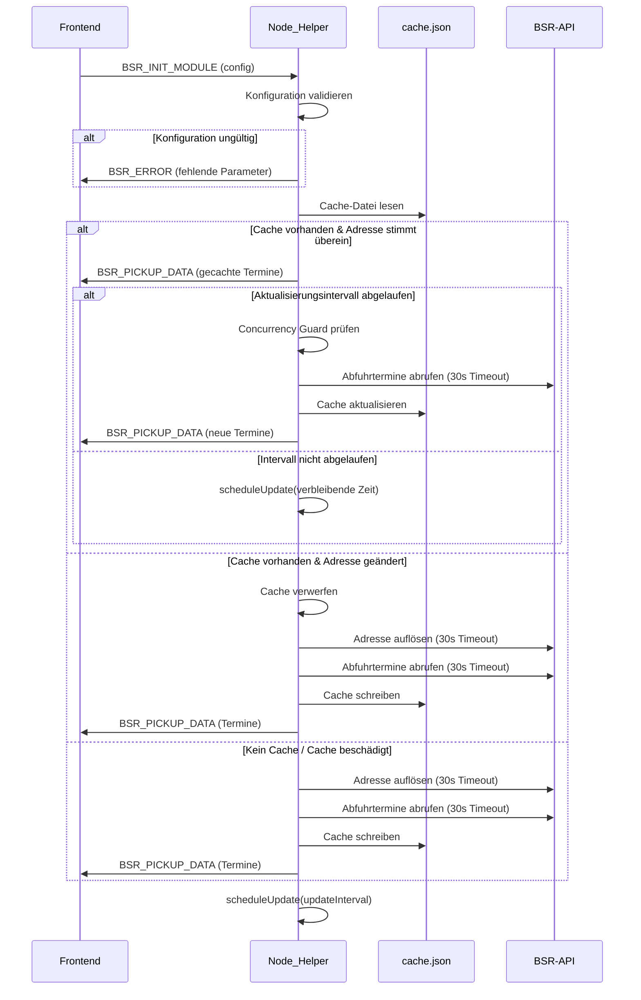
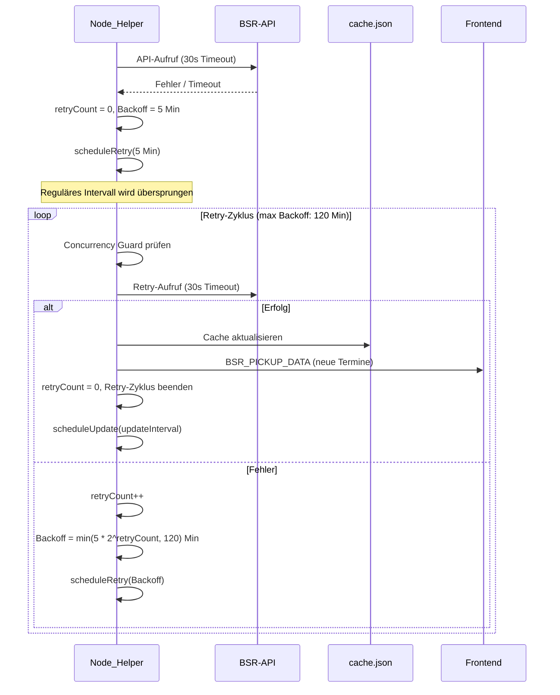
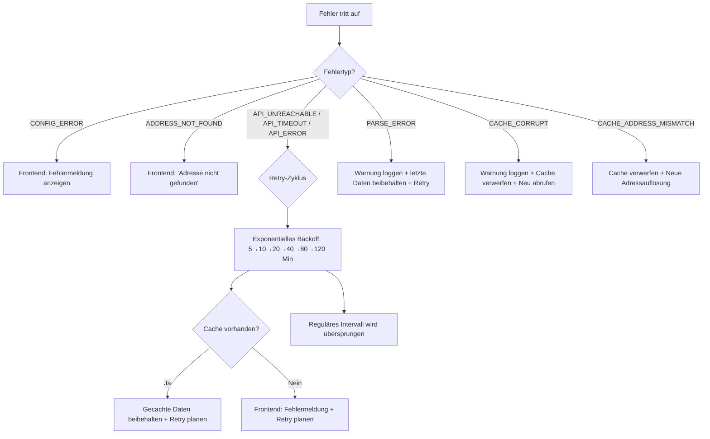

# Design-Dokument: MMM-BSR-Trash-Calendar

## Übersicht

MMM-BSR-Trash-Calendar ist ein MagicMirror²-Modul, das Abfuhrtermine der Berliner Stadtreinigung (BSR) und des Entsorgers ALBA für eine konfigurierte Berliner Adresse abruft und anzeigt. Das Modul folgt der Standard-MagicMirror²-Architektur mit einer klaren Trennung zwischen Frontend (Browser) und Backend (Node.js-Server), die über Socket-Notifications kommunizieren.

Das Backend übernimmt die Kommunikation mit der BSR-API (Adressauflösung und Kalenderabruf), das Caching der Daten in einer lokalen JSON-Datei, die periodische Aktualisierung sowie einen unabhängigen Retry-Mechanismus mit exponentiellem Backoff bei API-Fehlern. Das Frontend rendert die Abfuhrtermine als sortierte, farbcodierte Liste mit Icons und Hervorhebungen für heutige und morgige Termine.

### Designentscheidungen

- **Dateibasierter Cache mit Adressvergleich**: Übersteht MagicMirror-Neustarts und reduziert API-Aufrufe auf ein Minimum. Der Cache speichert die konfigurierte Adresse (Straße + Hausnummer), um bei Adressänderungen den gesamten Cache zu verwerfen (Anforderung 11.9).
- **Reine Funktionen für Kernlogik**: Parsing, Filterung, Sortierung, Datumsberechnung und Retry-Backoff-Berechnung werden als reine, testbare Funktionen in `utils.js` gebündelt.
- **Zwei API-Aufrufe für Kalender**: Aktueller und Folgemonat werden sequentiell abgerufen (wegen Concurrency Guard), um lückenlose Terminabdeckung zu gewährleisten (Anforderung 2.2).
- **Font Awesome Icons**: MagicMirror stellt Font Awesome bereit, daher keine zusätzlichen Abhängigkeiten für Icons nötig.
- **Unabhängiger Retry-Mechanismus**: Retry-Zyklen arbeiten unabhängig vom regulären Aktualisierungsintervall. Bei aktivem Retry wird das reguläre Intervall übersprungen. Ein erfolgreicher Retry setzt den Zähler zurück und startet das reguläre Intervall neu (Anforderung 2.5–2.9).
- **Concurrency Guard**: Maximal ein API-Aufruf gleichzeitig aktiv, um doppelte Anfragen zu verhindern (Anforderung 1.6). Implementiert als einfaches Boolean-Lock im Node_Helper.
- **30-Sekunden-Timeout**: Alle API-Aufrufe haben ein festes Timeout von 30 Sekunden, um hängende Verbindungen zu vermeiden (Anforderung 1.5).
- **TDD/BDD-Ansatz**: Tests werden vor der Implementierung geschrieben, Testfälle im BDD-Stil (Gegeben/Wenn/Dann) formuliert (Anforderung 9.8).
- **Inkrementelle Git-Commits**: Jede abgeschlossene Teilaufgabe wird als eigenständiger Git-Commit festgehalten. Commit-Messages werden in Englisch verfasst und folgen dem [Conventional Commits](https://www.conventionalcommits.org/) Format (z.B. `feat: add address resolution via BSR API`, `test: add BDD scenarios for category filtering`, `fix: handle empty categories array`). Große Änderungen werden in kleine, logisch zusammenhängende Commits aufgeteilt.
- **Dokumentation in Englisch**: Die gesamte Projektdokumentation (README.md, Code-Kommentare, JSDoc, CHANGELOG) wird in Englisch verfasst, um die internationale Nutzbarkeit des Moduls sicherzustellen (Anforderung 10).

## Architektur

```mermaid
graph TB
    subgraph MagicMirror²
        subgraph Browser
            FE["MMM-BSR-Trash-Calendar.js<br/>(Frontend)"]
            CSS["MMM-BSR-Trash-Calendar.css"]
        end
        subgraph "Node.js Server"
            NH["node_helper.js<br/>(Node_Helper)"]
            UTILS["utils.js<br/>(Reine Funktionen)"]
            CACHE["cache.json<br/>(Dateibasierter Cache)"]
        end
    end
    BSR["BSR-API<br/>umapi.bsr.de"]

    FE -- "BSR_INIT_MODULE<br/>(config)" --> NH
    NH -- "BSR_PICKUP_DATA<br/>(termine)" --> FE
    NH -- "BSR_ERROR<br/>(message)" --> FE
    NH --> UTILS
    NH -- "lesen/schreiben" --> CACHE
    NH -- "HTTP GET<br/>(30s Timeout)" --> BSR
```

### Ablauf beim Modulstart



### Retry-Ablauf bei API-Fehler



## Komponenten und Schnittstellen

### 1. Frontend: `MMM-BSR-Trash-Calendar.js`

Registriert sich als MagicMirror-Modul via `Module.register("MMM-BSR-Trash-Calendar", { ... })`.

```javascript
// Konfiguration mit Standardwerten
defaults: {
  street: "",                    // Pflicht: Straßenname
  houseNumber: "",               // Pflicht: Hausnummer
  dateFormat: "dd.MM.yyyy",      // Datumsformat
  maxEntries: 5,                 // Anzahl angezeigter Termine
  updateInterval: 86400000,      // Aktualisierungsintervall (ms)
  categories: ["BI", "HM", "LT", "WS", "WB"]  // Angezeigte Kategorien
}
```

**Methoden:**

| Methode                                             | Beschreibung                                                        |
| --------------------------------------------------- | ------------------------------------------------------------------- |
| `start()`                                           | Sendet `BSR_INIT_MODULE` mit Konfiguration an Node_Helper           |
| `getDom()`                                          | Erzeugt DOM-Elemente für die Terminliste, Lade- und Fehlermeldungen |
| `getStyles()`                                       | Gibt `["MMM-BSR-Trash-Calendar.css"]` zurück                        |
| `socketNotificationReceived(notification, payload)` | Verarbeitet `BSR_PICKUP_DATA` und `BSR_ERROR` Notifications         |

**Zustände:**

| Zustand   | Beschreibung                                             |
| --------- | -------------------------------------------------------- |
| `loading` | Initiale Ladephase, zeigt „Lade Abfuhrtermine..."        |
| `error`   | Fehler aufgetreten, zeigt Fehlermeldung                  |
| `data`    | Termine vorhanden, zeigt sortierte Terminliste           |
| `empty`   | Keine Termine verfügbar, zeigt „Keine Termine verfügbar" |

### 2. Backend: `node_helper.js`

Erstellt via `NodeHelper.create({ ... })`.

**Methoden:**

| Methode                                             | Beschreibung                                                                                                                                                                                                                                                       |
| --------------------------------------------------- | ------------------------------------------------------------------------------------------------------------------------------------------------------------------------------------------------------------------------------------------------------------------ |
| `start()`                                           | Initialisiert den Helper, setzt `requestLock = false`, `retryCount = 0`                                                                                                                                                                                            |
| `socketNotificationReceived(notification, payload)` | Verarbeitet `BSR_INIT_MODULE`, startet Datenfluss                                                                                                                                                                                                                  |
| `resolveAddress(street, houseNumber)`               | Ruft BSR-API Adress-Endpunkt auf (30s Timeout), gibt AdressSchlüssel zurück. Bei Fehler: Retry mit exponentiellem Backoff.                                                                                                                                         |
| `fetchPickupDates(addressKey)`                      | Ruft Abfuhrtermine für aktuellen und Folgemonat sequentiell ab (30s Timeout pro Aufruf)                                                                                                                                                                            |
| `executeApiCall(url)`                               | Führt einen einzelnen HTTP-GET-Aufruf mit 30s Timeout aus. Der Concurrency Guard (`requestLock`) wird auf der Ebene des gesamten Datenabruf-Zyklus gesetzt (nicht pro Einzelaufruf), damit sequentielle Aufrufe für zwei Monate sich nicht gegenseitig blockieren. |
| `loadCache()`                                       | Liest Cache-Datei, gibt `null` bei Fehler zurück                                                                                                                                                                                                                   |
| `saveCache(data)`                                   | Schreibt Cache-Datei als JSON                                                                                                                                                                                                                                      |
| `scheduleUpdate(interval)`                          | Plant nächste reguläre Aktualisierung via `setTimeout`. Wird bei aktivem Retry-Zyklus nicht ausgeführt.                                                                                                                                                            |
| `scheduleRetry()`                                   | Plant nächsten Retry mit exponentiellem Backoff. Berechnet Intervall via `calculateRetryDelay(retryCount)`.                                                                                                                                                        |
| `handleApiError(error)`                             | Startet Retry-Zyklus, bricht reguläres Intervall ab, behält gecachte Daten bei                                                                                                                                                                                     |
| `handleApiSuccess(data)`                            | Setzt `retryCount = 0`, speichert Cache, sendet Daten an Frontend, startet reguläres Intervall neu                                                                                                                                                                 |

**Zustandsvariablen:**

| Variable      | Typ                  | Beschreibung                                         |
| ------------- | -------------------- | ---------------------------------------------------- |
| `requestLock` | `boolean`            | Concurrency Guard — verhindert parallele API-Aufrufe |
| `retryCount`  | `number`             | Aktueller Retry-Zähler (0 = kein Retry aktiv)        |
| `retryTimer`  | `Timer\|null`        | Referenz auf aktiven Retry-Timer                     |
| `updateTimer` | `Timer\|null`        | Referenz auf aktiven regulären Update-Timer          |
| `isRetrying`  | `boolean`            | Flag ob ein Retry-Zyklus aktiv ist                   |
| `config`      | `object`             | Aktuelle Modulkonfiguration                          |
| `addressKey`  | `string\|null`       | Aufgelöster AdressSchlüssel                          |
| `currentData` | `PickupDate[]\|null` | Zuletzt erfolgreich abgerufene Termine               |

### 3. Utility-Modul: `utils.js`

Reine Funktionen, die sowohl vom Node_Helper als auch in Tests verwendet werden.

```javascript
// Exportierte Funktionen
parsePickupDates(apiResponse); // BSR-API-Antwort → Array<PickupDate> (nur zukünftige Termine, sortiert)
filterByCategories(dates, cats); // Filtert nach Abfallkategorien
sortByDate(dates); // Sortiert aufsteigend nach Datum
filterPastDates(dates, today); // Entfernt vergangene Termine (vor heute)
formatDate(date, format); // Formatiert Datum nach Konfiguration
getRelativeLabel(date, today); // Gibt "Heute", "Morgen" oder null zurück
getCategoryDisplay(code); // Kürzel → { name, color, icon }
validateConfig(config); // Validiert Konfiguration, gibt Fehler oder bereinigte Config zurück
serializePickupDate(pickupDate); // Internes Format → API-Format (für Round-Trip-Tests)
isCacheValid(cache, config, now, interval); // Prüft ob Cache gültig ist (inkl. Adressvergleich)
isCacheAddressMatch(cache, config); // Prüft ob Cache-Adresse mit Konfiguration übereinstimmt
calculateRetryDelay(retryCount); // Berechnet Backoff-Delay: min(5 * 2^retryCount, 120) Minuten
getMonthRange(now); // Gibt aktuellen und Folgemonat zurück (inkl. Jahreswechsel)
sanitizeCategories(categories); // Entfernt ungültige Kategorien, Fallback auf alle bei leerem Ergebnis
```

### 4. Stylesheet: `MMM-BSR-Trash-Calendar.css`

Definiert Styles für:

- `.bsr-trash-calendar` — Container
- `.bsr-entry` — Einzelner Termineintrag
- `.bsr-entry.today` — Hervorhebung für heutige Termine
- `.bsr-entry.tomorrow` — Hervorhebung für morgige Termine
- `.bsr-category-icon` — Farbiges Icon pro Kategorie
- `.bsr-category-name` — Kategoriename
- `.bsr-date` — Datumsanzeige
- `.bsr-warning` — Warnhinweis-Text
- `.bsr-error` — Fehlermeldung
- `.bsr-loading` — Lademeldung

### Socket-Notification-Protokoll

| Richtung | Notification      | Payload                             | Beschreibung                |
| -------- | ----------------- | ----------------------------------- | --------------------------- |
| FE → NH  | `BSR_INIT_MODULE` | `{ street, houseNumber, ... }`      | Modulkonfiguration senden   |
| NH → FE  | `BSR_PICKUP_DATA` | `{ dates: PickupDate[] }`           | Aufbereitete Abfuhrtermine  |
| NH → FE  | `BSR_ERROR`       | `{ message: string, type: string }` | Fehlermeldung mit Fehlertyp |

## Datenmodelle

### BSR-API-Antwort: Adressauflösung

```typescript
// GET https://umapi.bsr.de/p/de.bsr.adressen.app/plzSet/plzSet?searchQuery={street}:::{houseNumber}
type AddressLookupResponse = Array<{
  value: string; // AdressSchlüssel (z.B. "049011000102000049800120")
  label: string; // Anzeigename (z.B. "Bergmannstr. 12, 10965 Berlin")
}>;
```

### BSR-API-Antwort: Abfuhrtermine

```typescript
// GET https://umapi.bsr.de/p/de.bsr.adressen.app/abfuhrEvents?filter=...
type CalendarEventsResponse = {
  dates: {
    [date: string]: Array<{
      // Schlüssel: "YYYY-MM-DD"
      category: string; // "BI" | "HM" | "LT" | "WS" | "WB"
      serviceDay: string; // Wochentag
      serviceDate_actual: string; // Tatsächliches Abholdatum
      serviceDate_regular: string; // Reguläres Abholdatum
      rhythm: string; // Abholrhythmus
      warningText: string; // Warnhinweis (kann leer sein)
      disposalComp: string; // "BSR" | "ALBA"
    }>;
  };
};
```

### Internes Datenmodell: PickupDate

```typescript
type PickupDate = {
  date: string; // ISO-Datum "YYYY-MM-DD"
  category: string; // Abfallkategorie-Kürzel ("BI", "HM", etc.)
  categoryName: string; // Klartext ("Biogut", "Hausmüll", etc.)
  color: string; // CSS-Farbwert
  icon: string; // Font Awesome Icon-Klasse
  disposalCompany: string; // "BSR" | "ALBA"
  warningText: string; // Warnhinweis oder leerer String
};
```

### Kategorie-Mapping

```javascript
const CATEGORY_MAP = {
  BI: { name: "Biogut", color: "#8B4513", icon: "fa-seedling" },
  HM: { name: "Hausmüll", color: "#808080", icon: "fa-trash" },
  LT: { name: "Laubtonne", color: "#228B22", icon: "fa-leaf" },
  WS: { name: "Wertstoffe", color: "#FFD700", icon: "fa-recycle" },
  WB: { name: "Weihnachtsbaum", color: "#006400", icon: "fa-tree" },
};
```

### Cache-Datei: `cache.json`

```typescript
type CacheData = {
  street: string; // Konfigurierte Straße zum Zeitpunkt des Cachings
  houseNumber: string; // Konfigurierte Hausnummer zum Zeitpunkt des Cachings
  addressKey: string; // Gecachter AdressSchlüssel
  pickupDates: PickupDate[]; // Gecachte Abfuhrtermine
  lastFetchTimestamp: number; // Unix-Timestamp des letzten erfolgreichen Abrufs
};
```

### Konfiguration

```typescript
type ModuleConfig = {
  street: string; // Pflicht
  houseNumber: string; // Pflicht
  dateFormat?: string; // Standard: "dd.MM.yyyy"
  maxEntries?: number; // Standard: 5
  updateInterval?: number; // Standard: 86400000 (24h in ms)
  categories?: string[]; // Standard: ["BI", "HM", "LT", "WS", "WB"]
};
```

### Retry-Backoff-Tabelle

| Retry-Versuch    | Wartezeit         | Berechnung       |
| ---------------- | ----------------- | ---------------- |
| 0 (erster Retry) | 5 Minuten         | 5 × 2⁰ = 5       |
| 1                | 10 Minuten        | 5 × 2¹ = 10      |
| 2                | 20 Minuten        | 5 × 2² = 20      |
| 3                | 40 Minuten        | 5 × 2³ = 40      |
| 4                | 80 Minuten        | 5 × 2⁴ = 80      |
| 5+               | 120 Minuten (Max) | min(5 × 2ⁿ, 120) |

### BSR-API-Endpunkte

| Endpunkt             | URL-Template                                                                                                                                                                                       | Methode | Timeout |
| -------------------- | -------------------------------------------------------------------------------------------------------------------------------------------------------------------------------------------------- | ------- | ------- |
| Adressauflösung      | `https://umapi.bsr.de/p/de.bsr.adressen.app/plzSet/plzSet?searchQuery={street}:::{houseNumber}`                                                                                                    | GET     | 30s     |
| Abfuhrtermine (JSON) | `https://umapi.bsr.de/p/de.bsr.adressen.app/abfuhrEvents?filter=AddrKey eq '{addressKey}' and DateFrom eq datetime'{year}-{month}-01T00:00:00' and DateTo eq datetime'{year}-{month}-01T00:00:00'` | GET     | 30s     |

> **Hinweis:** Das Modul verwendet ausschließlich den JSON-Endpunkt für Abfuhrtermine.

## Korrektheitseigenschaften

_Eine Korrektheitseigenschaft (Property) ist ein Merkmal oder Verhalten, das für alle gültigen Ausführungen eines Systems gelten muss — im Wesentlichen eine formale Aussage darüber, was das System tun soll. Properties bilden die Brücke zwischen menschenlesbaren Spezifikationen und maschinell verifizierbaren Korrektheitsgarantien._

### Property 1: Parsing erzeugt sortierte, vollständige Terminliste

_Für jede_ gültige BSR-API-Antwort mit beliebigen Abfuhrterminen muss `parsePickupDates` eine Liste zurückgeben, die (a) aufsteigend nach Datum sortiert ist, (b) nur zukünftige Termine enthält und (c) das `serviceDate_actual`-Feld (Format `dd.MM.yyyy`) korrekt in das ISO-Format (`YYYY-MM-DD`) konvertiert.

**Validates: Requirements 3.1, 9.3**

### Property 2: Darstellung enthält alle Pflichtfelder und Warnhinweise

_Für jeden_ beliebigen `PickupDate`-Eintrag muss die Render-Funktion eine Darstellung erzeugen, die das Datum, den Kategorienamen und den Entsorgungsdienstleister enthält — und falls `warningText` nicht leer ist, auch den Warnhinweis.

**Validates: Requirements 3.2, 8.1**

### Property 3: maxEntries begrenzt die Ausgabe

_Für jede_ beliebige Terminliste und jeden positiven `maxEntries`-Wert darf die angezeigte Liste nie mehr als `maxEntries` Einträge enthalten, und die angezeigten Einträge müssen die chronologisch nächsten sein.

**Validates: Requirements 3.3**

### Property 4: Kategoriefilterung liefert nur konfigurierte Kategorien

_Für jede_ beliebige Terminliste und jede Teilmenge von Abfallkategorien muss `filterByCategories` eine Liste zurückgeben, in der jeder Eintrag eine Kategorie aus der konfigurierten Teilmenge hat und kein Eintrag mit einer konfigurierten Kategorie aus der Eingabe fehlt.

**Validates: Requirements 5.3, 12.3**

### Property 5: Konfigurationsvalidierung — gültige Config oder Fehler

_Für jede_ beliebige Konfiguration (mit oder ohne optionale Felder) muss `validateConfig` entweder (a) eine bereinigte Konfiguration mit allen Standardwerten zurückgeben, wenn `street` und `houseNumber` vorhanden sind, oder (b) einen beschreibenden Fehler mit den fehlenden Pflichtparametern zurückgeben — nie beides, nie keines.

**Validates: Requirements 5.1, 5.2, 5.4, 9.4**

### Property 6: Datumsklassifikation — Heute, Morgen oder null

_Für jedes_ beliebige Datum und jeden beliebigen Referenztag (heute) muss `getRelativeLabel` genau dann „Heute" zurückgeben, wenn das Datum gleich dem Referenztag ist, genau dann „Morgen", wenn das Datum der Folgetag ist, und in allen anderen Fällen `null`.

**Validates: Requirements 6.1, 6.2, 6.3**

### Property 7: Round-Trip — Parse und Serialize

_Für jeden_ gültigen `PickupDate`-Eintrag muss gelten: Wenn der Eintrag mit `serializePickupDate` in das API-Format überführt und anschließend mit `parsePickupDates` zurückgeparst wird, entsteht ein äquivalenter Eintrag.

**Validates: Requirements 9.5**

### Property 8: Idempotenz der Kategoriefilterung

_Für jede_ beliebige Terminliste und jede Teilmenge von Kategorien muss gelten: `filterByCategories(filterByCategories(dates, cats), cats)` ergibt dasselbe Ergebnis wie `filterByCategories(dates, cats)`.

**Validates: Requirements 9.6**

### Property 9: Ungültige Eingaben erzeugen definierten Fehler

_Für jede_ beliebige ungültige oder fehlerhafte API-Antwort (fehlende Felder, falscher Typ, null, undefined) muss `parsePickupDates` einen definierten Fehler werfen und darf keinen unbehandelten Ausnahmefehler erzeugen.

**Validates: Requirements 9.7**

### Property 10: Cache-Validierung — Intervall bestimmt Aktualisierung

_Für jeden_ beliebigen Cache-Zustand und Referenzzeitpunkt muss `isCacheValid` genau dann `false` zurückgeben (= Aktualisierung nötig), wenn das Aktualisierungsintervall seit dem letzten Abruf abgelaufen ist — unabhängig davon, ob noch zukünftige Termine im Cache vorhanden sind. Wenn das Intervall nicht abgelaufen ist und der Cache mindestens einen zukünftigen Termin enthält, muss `true` zurückgegeben werden.

**Validates: Requirements 11.3, 11.4**

### Property 11: Cache Round-Trip — Save und Load

_Für jedes_ gültige `CacheData`-Objekt (inkl. `street` und `houseNumber`) muss gelten: Wenn es mit `saveCache` als JSON gespeichert und anschließend mit `loadCache` geladen wird, entsteht ein äquivalentes Objekt.

**Validates: Requirements 11.7**

### Property 12: Cache-Invalidierung bei Adressänderung

_Für jeden_ Cache mit gespeicherter Adresse (Straße, Hausnummer) und jede Konfiguration mit einer abweichenden Adresse muss `isCacheAddressMatch` `false` zurückgeben. Nur wenn Straße und Hausnummer exakt übereinstimmen, darf `true` zurückgegeben werden.

**Validates: Requirements 11.9**

### Property 13: Kategorie-Bereinigung — Fallback auf alle Kategorien

_Für jedes_ beliebige `categories`-Array muss `sanitizeCategories` (a) alle ungültigen Einträge entfernen und (b) falls das Ergebnis leer ist (leeres Array oder alle Einträge ungültig), alle gültigen Kategorien (BI, HM, LT, WS, WB) zurückgeben.

**Validates: Requirements 12.4, 12.6**

### Property 14: Exponentielles Backoff — korrekte Berechnung

_Für jeden_ beliebigen Retry-Zähler (retryCount ≥ 0) muss `calculateRetryDelay` den Wert `min(5 × 2^retryCount, 120)` Minuten (in Millisekunden) zurückgeben. Der Wert darf nie kleiner als 5 Minuten und nie größer als 120 Minuten sein.

**Validates: Requirements 2.6**

### Property 15: Monatsbereich mit Jahreswechsel

_Für jedes_ beliebige Datum muss `getMonthRange` den aktuellen Monat und den Folgemonat zurückgeben. Wenn das Datum im Dezember liegt, muss der Folgemonat Januar des nächsten Jahres sein.

**Validates: Requirements 2.2**

### Property 16: Concurrency Guard — maximal ein aktiver Aufruf

_Für jede_ beliebige Sequenz von gleichzeitigen API-Aufruf-Versuchen muss der Concurrency Guard sicherstellen, dass höchstens ein Aufruf gleichzeitig ausgeführt wird. Wenn `requestLock` gesetzt ist, müssen weitere Aufrufe abgelehnt oder in eine Warteschlange gestellt werden.

**Validates: Requirements 1.6**

## Fehlerbehandlung

### Fehlerkategorien

| Fehlertyp                | Auslöser                                          | Verhalten                                                                                                              |
| ------------------------ | ------------------------------------------------- | ---------------------------------------------------------------------------------------------------------------------- |
| `CONFIG_ERROR`           | Pflichtparameter fehlen                           | Frontend zeigt Fehlermeldung mit fehlenden Parametern. Kein API-Aufruf.                                                |
| `ADDRESS_NOT_FOUND`      | BSR-API gibt leeres Array zurück                  | Frontend zeigt „Adresse nicht gefunden". Kein Retry.                                                                   |
| `API_UNREACHABLE`        | Netzwerkfehler oder Timeout (30s) bei API-Aufruf  | Node_Helper startet Retry-Zyklus mit exponentiellem Backoff (5→10→20→40→80→120 Min). Gecachte Daten bleiben angezeigt. |
| `API_TIMEOUT`            | API antwortet nicht innerhalb von 30 Sekunden     | Wird wie `API_UNREACHABLE` behandelt — Aufruf wird abgebrochen, Retry-Zyklus startet.                                  |
| `API_ERROR`              | BSR-API gibt HTTP-Fehler zurück                   | Wie `API_UNREACHABLE` — Retry mit exponentiellem Backoff.                                                              |
| `PARSE_ERROR`            | API-Antwort hat unerwartetes Format               | Node_Helper loggt Warnung, behält letzte gültige Daten bei, startet Retry-Zyklus.                                      |
| `CACHE_CORRUPT`          | Cache-Datei nicht lesbar oder ungültiges JSON     | Node_Helper verwirft Cache, loggt Warnung, ruft Daten neu ab.                                                          |
| `CACHE_ADDRESS_MISMATCH` | Konfigurierte Adresse weicht von Cache-Adresse ab | Node_Helper verwirft gesamten Cache, führt neue Adressauflösung durch.                                                 |

### Fehlerfluss



### Retry-Strategie (Exponentielles Backoff)

- **Auslöser**: `API_UNREACHABLE`, `API_TIMEOUT`, `API_ERROR`, `PARSE_ERROR`
- **Gilt für**: Sowohl Terminabruf als auch Adressauflösung (Anforderung 1.4)
- **Backoff-Formel**: `delay = min(5 × 2^retryCount, 120)` Minuten
- **Backoff-Sequenz**: 5 Min → 10 Min → 20 Min → 40 Min → 80 Min → 120 Min (Maximum)
- **Verhalten bei aktivem Retry**: Reguläres Aktualisierungsintervall wird übersprungen (Anforderung 2.8)
- **Verhalten bei erfolgreichem Retry**: Retry-Zähler wird auf 0 zurückgesetzt, reguläres Intervall startet neu ab diesem Zeitpunkt (Anforderung 2.7, 2.9)
- **Concurrency**: Maximal ein aktiver API-Aufruf gleichzeitig (`requestLock`). Retry-Versuche werden abgelehnt, wenn ein Aufruf bereits läuft.
- **Timer-Management**: Maximal ein aktiver Timer (Retry oder regulär). Neuer Timer bricht vorherigen ab.

## Teststrategie

### Test-Framework

- **Unit-Tests und Integrationstests:** [vitest](https://vitest.dev/) — schnell, ESM-kompatibel, gute MagicMirror-Kompatibilität
- **Property-Based-Tests:** [fast-check](https://fast-check.dev/) — ausgereiftes PBT-Framework für JavaScript/TypeScript

### TDD/BDD-Ansatz

Tests werden vor der Implementierung geschrieben (Anforderung 9.8). Alle Testfälle sind im BDD-Stil (Gegeben/Wenn/Dann) formuliert. Die 24 BDD-Szenarien aus den Anforderungen bilden die Grundlage für die Teststruktur.

### Teststruktur

```
tests/
├── unit/
│   ├── utils.test.js          # Unit-Tests für reine Funktionen (BDD-Szenarien)
│   ├── config.test.js         # Unit-Tests für Konfigurationsvalidierung
│   └── retry.test.js          # Unit-Tests für Retry-Logik und Backoff
├── property/
│   ├── parsing.property.js    # Property-Tests für Parsing (Property 1, 7, 9)
│   ├── filtering.property.js  # Property-Tests für Filterung (Property 4, 8, 13)
│   ├── display.property.js    # Property-Tests für Darstellung (Property 2, 3, 6)
│   ├── config.property.js     # Property-Tests für Konfiguration (Property 5)
│   ├── cache.property.js      # Property-Tests für Cache (Property 10, 11, 12)
│   ├── retry.property.js      # Property-Tests für Retry-Backoff (Property 14)
│   └── calendar.property.js   # Property-Tests für Monatsbereich (Property 15)
└── integration/
    ├── socket.test.js         # Integrationstests für Socket-Kommunikation
    └── concurrency.test.js    # Integrationstests für Concurrency Guard (Property 16)
```

### Dualer Testansatz

**Unit-Tests** (spezifische Beispiele, Randfälle und BDD-Szenarien):

| BDD-Szenario                                   | Testdatei           | Beschreibung                      |
| ---------------------------------------------- | ------------------- | --------------------------------- |
| 1: Erfolgreiche Adressauflösung                | socket.test.js      | Gültige Adresse → AdressSchlüssel |
| 2: Adresse nicht gefunden                      | socket.test.js      | Ungültige Adresse → Fehlermeldung |
| 3: Sortierte Anzeige                           | utils.test.js       | Termine aufsteigend sortiert      |
| 4: Kategoriefilterung                          | utils.test.js       | Nur konfigurierte Kategorien      |
| 5: Heutiger Termin hervorgehoben               | utils.test.js       | Label „Heute" + Hervorhebung      |
| 6: Cache beim Neustart                         | socket.test.js      | Gecachte Termine sofort angezeigt |
| 7: Warnhinweis angezeigt                       | utils.test.js       | warningText wird dargestellt      |
| 8: Ungültige API-Antwort                       | utils.test.js       | Definierter Fehler                |
| 9: Unbekannte Kategorie                        | config.test.js      | „XX" ignoriert + Warnung          |
| 10: API nicht erreichbar mit Cache             | socket.test.js      | Gecachte Daten + Retry            |
| 11: API nicht erreichbar ohne Cache            | socket.test.js      | Fehlermeldung + Retry             |
| 12: Cache abgelaufen, API nicht erreichbar     | socket.test.js      | Veraltete Daten als Fallback      |
| 13: Cache vs. API-Daten                        | socket.test.js      | Neue Daten überschreiben Cache    |
| 14: Retry mit exponentiellem Backoff           | retry.test.js       | 5 Min → 10 Min Backoff            |
| 15: Reguläres Intervall bei aktivem Retry      | retry.test.js       | Intervall wird übersprungen       |
| 16: Erfolgreicher Retry setzt Intervall zurück | retry.test.js       | Zähler reset + neues Intervall    |
| 17: Adresse in Konfiguration geändert          | socket.test.js      | Cache verworfen + Neuabruf        |
| 18: Mehrere Abfallarten am selben Tag          | utils.test.js       | Separate Einträge                 |
| 19: Jahreswechsel Dezember-Januar              | utils.test.js       | Dez + Jan korrekt                 |
| 20: Leeres categories-Array                    | config.test.js      | Fallback auf alle + Warnung       |
| 21: API-Timeout                                | concurrency.test.js | Abbruch nach 30s + Retry          |
| 22: Morgiger Termin hervorgehoben              | utils.test.js       | Label „Morgen"                    |
| 23: maxEntries begrenzt Anzeige                | utils.test.js       | Nur 3 von 10 Terminen             |
| 24: Pflicht-Parameter fehlen                   | config.test.js      | Fehlermeldung „street"            |

Zusätzliche Unit-Tests:

- Feste Kategorie-Mappings (4.1, 4.2, 4.3): Alle 5 Kategorien mit korrektem Namen, Farbe und Icon
- Leere Terminliste (3.4): Prüft „Keine Termine verfügbar"-Meldung
- Ladezustand (3.5): Prüft Lademeldung
- Beschädigter Cache (11.8): Prüft Verwerfen und Neuabruf

**Property-Based-Tests** (universelle Eigenschaften, min. 100 Iterationen):

Jeder Property-Test wird mit einem Kommentar getaggt:

- `// Feature: mmm-bsr-trash-calendar, Property 1: Parsing erzeugt sortierte, vollständige Terminliste`
- `// Feature: mmm-bsr-trash-calendar, Property 2: Darstellung enthält alle Pflichtfelder und Warnhinweise`
- `// Feature: mmm-bsr-trash-calendar, Property 3: maxEntries begrenzt die Ausgabe`
- `// Feature: mmm-bsr-trash-calendar, Property 4: Kategoriefilterung liefert nur konfigurierte Kategorien`
- `// Feature: mmm-bsr-trash-calendar, Property 5: Konfigurationsvalidierung — gültige Config oder Fehler`
- `// Feature: mmm-bsr-trash-calendar, Property 6: Datumsklassifikation — Heute, Morgen oder null`
- `// Feature: mmm-bsr-trash-calendar, Property 7: Round-Trip — Parse und Serialize`
- `// Feature: mmm-bsr-trash-calendar, Property 8: Idempotenz der Kategoriefilterung`
- `// Feature: mmm-bsr-trash-calendar, Property 9: Ungültige Eingaben erzeugen definierten Fehler`
- `// Feature: mmm-bsr-trash-calendar, Property 10: Cache-Validierung — Intervall bestimmt Aktualisierung`
- `// Feature: mmm-bsr-trash-calendar, Property 11: Cache Round-Trip — Save und Load`
- `// Feature: mmm-bsr-trash-calendar, Property 12: Cache-Invalidierung bei Adressänderung`
- `// Feature: mmm-bsr-trash-calendar, Property 13: Kategorie-Bereinigung — Fallback auf alle Kategorien`
- `// Feature: mmm-bsr-trash-calendar, Property 14: Exponentielles Backoff — korrekte Berechnung`
- `// Feature: mmm-bsr-trash-calendar, Property 15: Monatsbereich mit Jahreswechsel`
- `// Feature: mmm-bsr-trash-calendar, Property 16: Concurrency Guard — maximal ein aktiver Aufruf`

Jede Korrektheitseigenschaft wird durch genau einen Property-Based-Test implementiert.

### CI/CD-Pipeline und Code-Qualitäts-Tooling

#### GitHub Actions Workflow (`.github/workflows/ci.yml`)

```yaml
name: CI
on:
  push:
    branches: [main]
  pull_request:
    branches: [main]

jobs:
  ci:
    runs-on: ubuntu-latest
    strategy:
      matrix:
        node-version: [18.x, 20.x]
    steps:
      - uses: actions/checkout@v4
      - uses: actions/setup-node@v4
        with:
          node-version: ${{ matrix.node-version }}
          cache: "npm"
      - run: npm ci
      - run: npm run lint
      - run: npm run format:check
      - run: npm run test:unit
      - run: npm run test:property
      - run: npm run test:integration
```

#### Projektstruktur für Tooling

```
MMM-BSR-Trash-Calendar/
├── .github/
│   └── workflows/
│       └── ci.yml              # GitHub Actions CI-Pipeline
├── .husky/
│   ├── pre-commit              # Lint-staged vor jedem Commit
│   └── commit-msg              # Commitlint für Commit-Messages
├── .editorconfig               # Editor-Einstellungen (Einrückung, Zeilenende)
├── .eslintrc.json              # ESLint-Konfiguration
├── .gitignore                  # Git-Ignore-Regeln
├── .prettierrc                 # Prettier-Konfiguration
├── .commitlintrc.json          # Commitlint-Konfiguration (Conventional Commits)
├── .lintstagedrc.json          # Lint-staged-Konfiguration
├── package.json                # Scripts, Dependencies, Husky-Setup
└── ...
```

#### npm Scripts

```json
{
  "scripts": {
    "lint": "eslint *.js utils.js tests/**/*.js",
    "lint:fix": "eslint --fix *.js utils.js tests/**/*.js",
    "format": "prettier --write *.js utils.js tests/**/*.js *.json *.css",
    "format:check": "prettier --check *.js utils.js tests/**/*.js *.json *.css",
    "test": "vitest run",
    "test:unit": "vitest run tests/unit/",
    "test:property": "vitest run tests/property/",
    "test:integration": "vitest run tests/integration/",
    "prepare": "husky"
  }
}
```

#### Tooling-Konfigurationen

**ESLint** (`.eslintrc.json`): Basiert auf `eslint:recommended`, erweitert um MagicMirror-Globals (`Module`, `Log`, `MM`).

**Prettier** (`.prettierrc`): 2 Spaces Einrückung, Semikolons, doppelte Anführungszeichen, 100 Zeichen Zeilenbreite.

**Commitlint** (`.commitlintrc.json`): Verwendet `@commitlint/config-conventional`. Erlaubte Typen: `feat`, `fix`, `test`, `docs`, `chore`, `refactor`, `style`, `ci`.

**Lint-staged** (`.lintstagedrc.json`): Führt ESLint und Prettier nur auf geänderten `.js`-, `.json`- und `.css`-Dateien aus.

**EditorConfig** (`.editorconfig`): UTF-8, LF-Zeilenende, 2 Spaces, Trailing Whitespace entfernen.

**Git-Ignore** (`.gitignore`):

```gitignore
# Dependencies
node_modules/

# Cache (runtime-generated, user-specific)
cache.json

# OS files
.DS_Store
Thumbs.db

# IDE / Editor
.vscode/
.idea/
*.swp
*.swo

# Test coverage
coverage/

# Logs
*.log
npm-debug.log*

# Environment
.env
.env.local
```

### Generatoren für fast-check

```javascript
// Basis-Generatoren
const arbCategory = fc.constantFrom("BI", "HM", "LT", "WS", "WB");
const arbDate = fc
  .date({ min: new Date("2024-01-01"), max: new Date("2026-12-31") })
  .map((d) => d.toISOString().slice(0, 10));
const arbDisposalComp = fc.constantFrom("BSR", "ALBA");
const arbWarningText = fc.oneof(fc.constant(""), fc.string({ minLength: 1, maxLength: 100 }));

// API-Event-Generator
const arbApiEvent = fc.record({
  category: arbCategory,
  serviceDay: fc.constantFrom("Mo", "Di", "Mi", "Do", "Fr"),
  serviceDate_actual: arbDate,
  serviceDate_regular: arbDate,
  rhythm: fc.string({ minLength: 1, maxLength: 20 }),
  warningText: arbWarningText,
  disposalComp: arbDisposalComp,
});

// API-Antwort-Generator
const arbApiResponse = fc
  .dictionary(arbDate, fc.array(arbApiEvent, { minLength: 1, maxLength: 5 }))
  .map((dates) => ({ dates }));

// Konfiguration-Generator (inkl. leere/ungültige categories)
const arbConfig = fc.record({
  street: fc.string({ minLength: 1, maxLength: 50 }),
  houseNumber: fc.string({ minLength: 1, maxLength: 10 }),
  dateFormat: fc.optional(fc.constantFrom("dd.MM.yyyy", "yyyy-MM-dd", "dd/MM/yyyy")),
  maxEntries: fc.optional(fc.integer({ min: 1, max: 50 })),
  updateInterval: fc.optional(fc.integer({ min: 60000, max: 604800000 })),
  categories: fc.optional(fc.subarray(["BI", "HM", "LT", "WS", "WB"], { minLength: 1 })),
});

// Retry-Count-Generator
const arbRetryCount = fc.integer({ min: 0, max: 20 });

// Cache-Generator (mit Adressfeldern)
const arbCacheData = fc.record({
  street: fc.string({ minLength: 1, maxLength: 50 }),
  houseNumber: fc.string({ minLength: 1, maxLength: 10 }),
  addressKey: fc.string({ minLength: 1, maxLength: 50 }),
  pickupDates: fc.array(
    fc.record({
      date: arbDate,
      category: arbCategory,
      categoryName: fc.string({ minLength: 1, maxLength: 20 }),
      color: fc.string({ minLength: 4, maxLength: 7 }),
      icon: fc.string({ minLength: 1, maxLength: 20 }),
      disposalCompany: arbDisposalComp,
      warningText: arbWarningText,
    }),
    { minLength: 0, maxLength: 20 }
  ),
  lastFetchTimestamp: fc.integer({ min: 0, max: Date.now() + 86400000 }),
});

// Ungültige Kategorien-Generator (für Property 13)
const arbInvalidCategory = fc
  .string({ minLength: 1, maxLength: 3 })
  .filter((s) => !["BI", "HM", "LT", "WS", "WB"].includes(s));
const arbMixedCategories = fc.array(fc.oneof(arbCategory, arbInvalidCategory), {
  minLength: 0,
  maxLength: 10,
});
```
